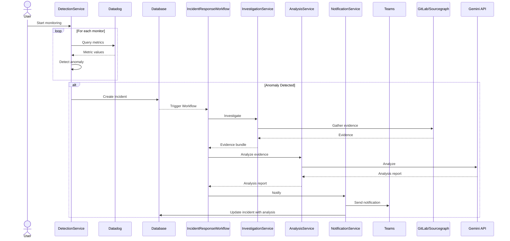

```mermaid
sequenceDiagram
    actor User
    participant DetectionService
    participant Datadog
    participant Database
    participant IncidentResponseWorkflow
    participant InvestigationService
    participant AnalysisService
    participant NotificationService
    participant Teams

    User->>DetectionService: Start monitoring
    loop For each monitor
        DetectionService->>Datadog: Query metrics
        Datadog-->>DetectionService: Metric values
        DetectionService->>DetectionService: Detect anomaly
    end

    alt Anomaly Detected
        DetectionService->>Database: Create Incident
        Database-->>IncidentResponseWorkflow: Trigger Workflow

        IncidentResponseWorkflow->>InvestigationService: Investigate
        InvestigationService->>GitLab/Sourcegraph: Gather evidence
        GitLab/Sourcegraph-->>InvestigationService: Evidence
        InvestigationService-->>IncidentResponseWorkflow: Evidence bundle

        IncidentResponseWorkflow->>AnalysisService: Analyze evidence
        AnalysisService->>Gemini API: Analyze
        Gemini API-->>AnalysisService: Analysis report
        AnalysisService-->>IncidentResponseWorkflow: Analysis report

        IncidentResponseWorkflow->>NotificationService: Notify
        NotificationService->>Teams: Send notification
        NotificationService->>Database: Update incident with analysis
    end
```
